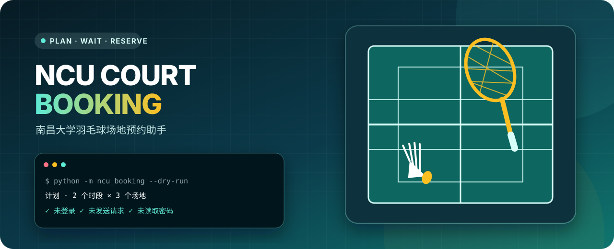
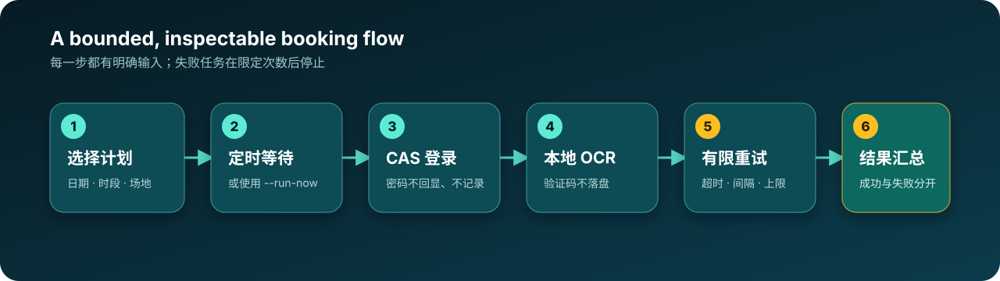

  

  <a href="README.md">中文</a> · <strong>English</strong>

# NCU Court Booking

An interactive Python CLI for the Nanchang University badminton booking flow. It reads credentials safely, waits for a chosen start time, expands multiple courts and time slots into tasks, and retries temporary failures within explicit limits.

> [!IMPORTANT]
> This is an experimental tool and has not been revalidated end to end against the current production booking system. APIs, opening times, and institutional rules may change. Start with <code>--dry-run</code> and avoid high-frequency requests.

## Highlights

- **No bundled credentials:** passwords are never hard-coded and terminal input is hidden.
- **One maintained entry point:** configuration, models, HTTP behavior, and CLI flow are separated.
- **Safe planning:** <code>--dry-run</code> displays the complete plan without credentials or network access.
- **Bounded retries:** each task has a request timeout, retry limit, and session-refresh interval.
- **Lean source repository:** generated PyInstaller directories and binaries are excluded from Git.

## Workflow

  

Each selected time-slot/court pair becomes an independent task. Successful tasks leave the queue immediately; failed tasks stop after the configured maximum.

## Quick start

Python 3.9 or newer is required. OCR/ONNX wheel availability depends on your operating system and Python version.

~~~bash
git clone https://github.com/Nanqipro/Sports-Court-Booking-Script.git
cd Sports-Court-Booking-Script

python -m venv .venv
source .venv/bin/activate       # macOS / Linux
# .\.venv\Scripts\Activate.ps1  # Windows PowerShell

python -m pip install -r requirements.txt
python -m ncu_booking --dry-run
python -m ncu_booking
~~~

Use <code>python -m ncu_booking --run-now</code> to skip the scheduled wait, or <code>python run.py</code> as a compatibility entry point.

## Configuration

The safest default is to enter credentials at runtime. The password prompt does not echo input.

~~~bash
cp config.example.ini config.ini
~~~

<code>config.ini</code> is ignored by Git. Environment variables take precedence over INI values, and <code>--config PATH</code> selects a different file.

| Setting | Default | Purpose |
| --- | ---: | --- |
| <code>BADMINTON_USERNAME</code> | empty | Student ID; prompted when empty |
| <code>BADMINTON_PASSWORD</code> | empty | Password; keeping this empty is recommended |
| <code>DEBUG</code> | <code>false</code> | Debug logs without passwords or full tokens |
| <code>REQUEST_TIMEOUT</code> | <code>10</code> | Per-request timeout in seconds |
| <code>MAX_ATTEMPTS</code> | <code>5</code> | Maximum attempts for each task |
| <code>RETRY_DELAY</code> | <code>1</code> | Delay before retrying a failed task |
| <code>TOKEN_REFRESH_INTERVAL</code> | <code>5</code> | Refresh login after this many booking requests |

## Commands

~~~text
--config PATH  use a local INI file
--run-now      skip the scheduled wait
--dry-run      plan only; do not log in or send requests
--debug        show debug logs
~~~

## Repository layout

~~~text
.
├── ncu_booking/        # CLI, client, configuration, and domain models
├── tests/              # unit tests with no production network access
├── packaging/          # optional PyInstaller configuration
├── docs/readme-assets/ # repository-owned README visuals
├── config.example.ini
└── requirements.txt
~~~

## Tests and optional packaging

~~~bash
python -m unittest discover -s tests -v
~~~

The optional Windows-oriented PyInstaller flow has not yet been revalidated:

~~~bash
python -m pip install -r requirements-dev.txt
pyinstaller --clean packaging/ncu-court-booking.spec
~~~

## Security, privacy, and limits

- Credentials are sent only to the NCU CAS login flow; CAPTCHA recognition runs locally through <code>ddddocr</code>.
- Do not post configuration files, student IDs, tokens, raw responses, or private screenshots in Issues.
- Older repository history contained hard-coded credentials. Rotate those credentials and clean the history—or publish from a fresh repository—before exposing the existing history.
- The current code covers the badminton endpoint and 12 court identifiers. CAS fields, time slots, CAPTCHA behavior, and booking APIs may change.
- The tool does not bypass permissions, payments, or institutional policies and cannot guarantee a successful reservation.

See [CONTRIBUTING.md](CONTRIBUTING.md) before proposing changes.

## License

**No license has been selected yet.** Public visibility is not an open-source grant. Do not copy, distribute, or sublicense the project until the rights holder adds a <code>LICENSE</code> file.

---

This independent learning project is not affiliated with or endorsed by Nanchang University.

